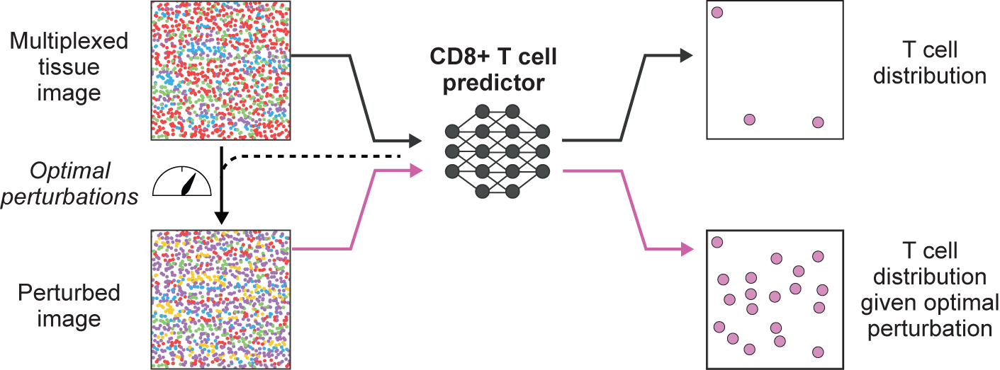

Morpheus is an integrated deep learning framework that takes large scale spatial omics profiles of patient tumors, and combines a formulation of T-cell infiltration prediction as a self-supervised machine learning problem with a counterfactual optimization strategy to generate minimal tumor perturbations predicted to boost T-cell infiltration.

